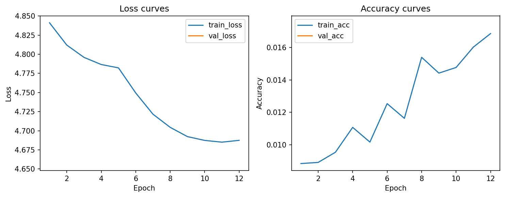
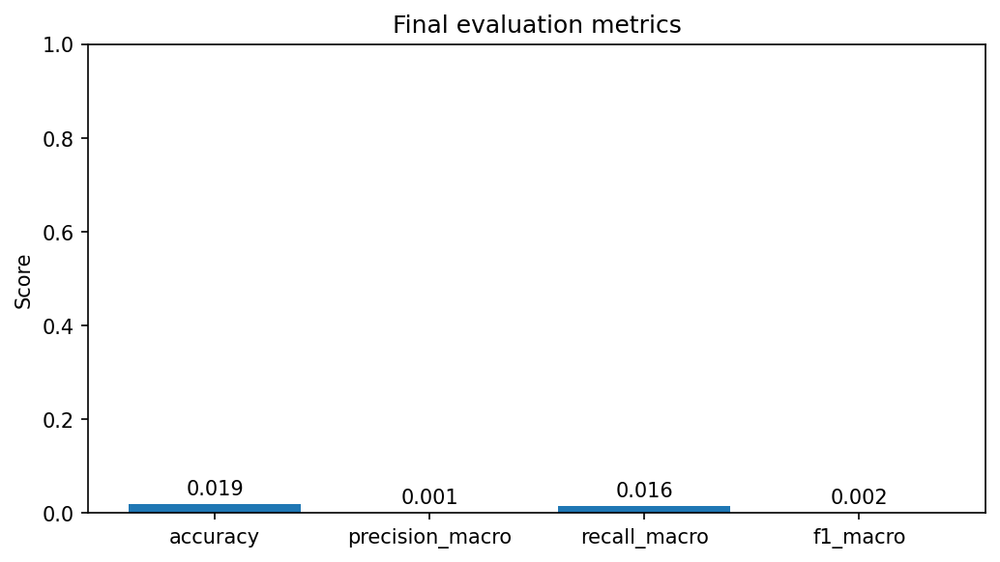
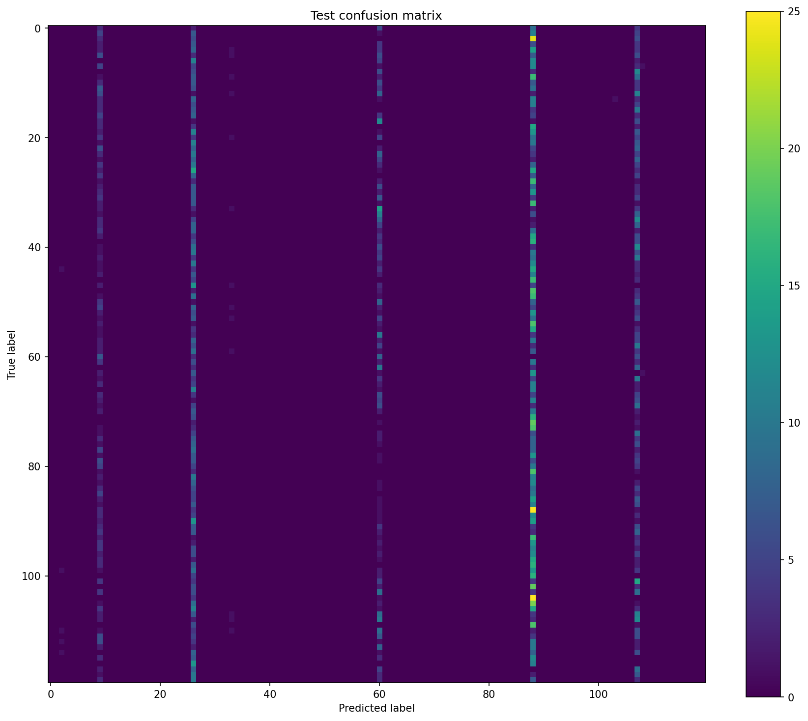

# Лабораторная работа №1
## Реализация модели глубокого обучения для классификации изображений

**Вариант 5:** Fractal-Net, MixUp, AdaSmoothDelta  
**Фактически выполненный эксперимент:** обучение модели с нуля с использованием **Adam**  
**Среда выполнения:** Google Colab (GPU)

---

## 1. Постановка задачи и цель работы

**Цель работы** — освоить практические навыки реализации и запуска модели глубокого обучения для задачи классификации изображений.

**Постановка задачи.** Необходимо используя датасет **Stanford Dogs**, разделить его на обучающую, валидационную и тестовую выборки в соотношении 70/15/15, реализовать модель в соответствии с архитектурой варианта, провести обучение и оценить качество модели по метрикам **Precision**, **Recall** и **F1-score**. 

---

## 2. Теоретическая часть

### 2.1. Архитектура Fractal-Net

Fractal-Net — это глубокая сверточная нейронная сеть, в которой блоки организованы по фрактальному принципу. Внутри одного блока присутствуют несколько путей разной глубины, а результаты их работы объединяются. Такой подход позволяет формировать как короткие, так и длинные пути распространения сигнала. Одной из особенностей архитектуры является возможность отключения отдельных путей в процессе обучения, что способствует регуляризации модели.

### 2.3. Оптимизатор Adam

Adam — адаптивный оптимизатор, который использует оценки первых и вторых моментов градиента. Он широко применяется в задачах глубокого обучения благодаря устойчивости и хорошей скорости сходимости.

---

## 3. Практическая часть

### 3.1. Подготовка данных

Для работы использовался датасет **Stanford Dogs**. Данные были автоматически разделены на три части:
- **train** — 70%
- **evaluate** — 15%
- **test** — 15%

Работа выполнялась в **Google Colab** с использованием GPU.

### 3.2. Выполненный эксперимент

Была выполнена следующая работа:

| Эксперимент | Инициализация | Оптимизатор | Особенности |
|---|---|---|---|
| Обучение с нуля | случайная | Adam | Fractal-Net + MixUp |

### 3.3. Результаты обучения

В процессе обучения был получен следующий лучший результат на валидационной выборке:

- **Best validation accuracy:** **1.7521%**

Также в журнале запуска были зафиксированы итоговые метрики тестирования:

- **Test accuracy:** **1.9063%**
- **Precision (macro):** **0.0013**
- **Recall (macro):** **0.0156**
- **F1-score (macro):** **0.0018**

Дополнительно при отдельной оценке модели были получены следующие значения:

- **Accuracy:** **1.7521%**
- **Precision (macro):** **0.0012**
- **Recall (macro):** **0.0143**
- **F1-score (macro):** **0.0017**
- **Loss:** **4.6708**

### 3.4. Графики обучения и итоговые визуализации

#### Кривые обучения

На графике функции потерь видно постепенное уменьшение значения `train_loss` по эпохам. Одновременно наблюдается небольшой рост точности на обучающей выборке. Это говорит о том, что модель действительно обучалась, однако темп улучшения качества оставался низким.

#### Итоговые метрики

Диаграмма показывает очень низкие значения accuracy, precision, recall и F1-score. Это означает, что модель пока недостаточно хорошо различает классы на рассматриваемом датасете.

#### Матрица ошибок

По матрице ошибок видно, что модель склонна предсказывать ограниченное число классов значительно чаще остальных. Это свидетельствует о слабой обученности модели и низком качестве разделения классов на тестовой выборке.

### 3.5. Анализ результатов

Полученные результаты показывают, что модель в текущей конфигурации продемонстрировала низкое качество классификации. Несмотря на постепенное уменьшение ошибки обучения, итоговые значения accuracy и F1-score остались близкими к нулю. Возможные причины такого результата:

- слишком малое число эпох обучения;
- сложность датасета Stanford Dogs из-за большого числа пород и визуальной схожести классов;
- недостаточная настройка гиперпараметров.

---

## 4. Выводы

В ходе лабораторной работы была реализована и протестирована модель **Fractal-Net** для задачи классификации изображений из датасета **Stanford Dogs**. Было выполнено разбиение датасета на обучающую, валидационную и тестовую выборки, подготовлен и запущен обучающий конвейер в среде **Google Colab**, а также получены численные метрики качества и визуализации результатов.

Эксперимент с обучением модели с нуля на оптимизаторе **Adam** показал, что модель обучается, однако полученное качество оказалось низким. Это говорит о необходимости дальнейшей настройки параметров, увеличения времени обучения.

---

## 5. Использованные источники

1. Larsson G., Maire M., Shakhnarovich G. **FractalNet: Ultra-deep neural networks without residuals**.
2. Stanford Dogs Dataset.
3. Документация PyTorch.
4. Zhang H. et al. **mixup: Beyond Empirical Risk Minimization**.
5. Kingma D. P., Ba J. **Adam: A Method for Stochastic Optimization**.