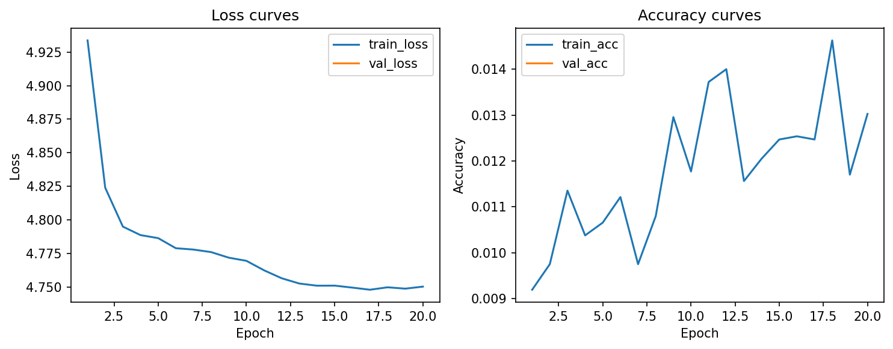
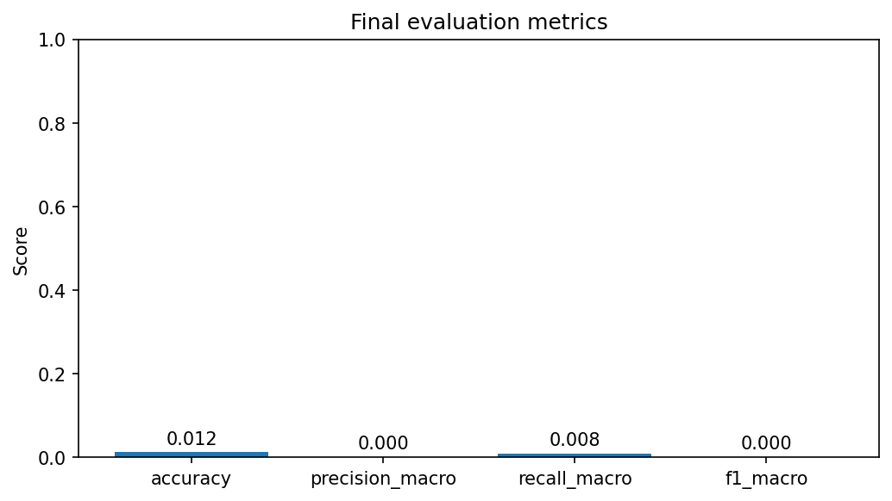
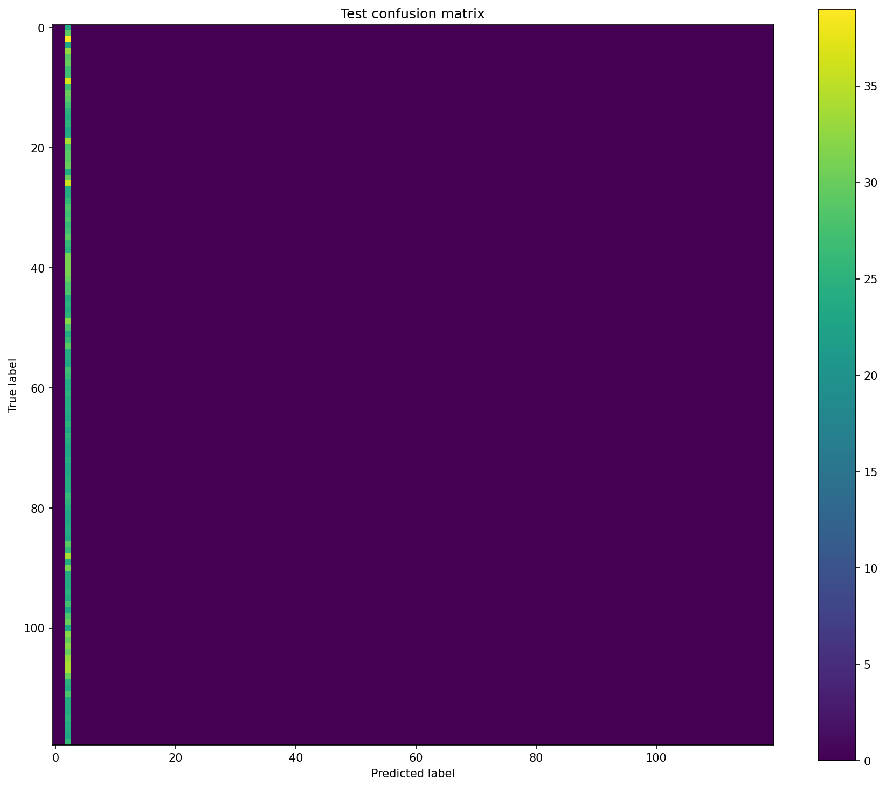

# Лабораторная работа №1
## Реализация модели глубокого обучения для классификации изображений

**Вариант 5:** Fractal-Net, MixUp, AdaSmoothDelta  
**Фактически выполненный эксперимент:** обучение модели с нуля с использованием **Adam**  
**Среда выполнения:** Google Colab (GPU)

---

## 1. Постановка задачи и цель работы

**Цель работы** — освоить практические навыки реализации и запуска модели глубокого обучения для задачи классификации изображений.

**Постановка задачи.** Необходимо используя датасет **Stanford Dogs**, разделить его на обучающую, валидационную и тестовую выборки в соотношении 70/15/15, реализовать модель в соответствии с архитектурой варианта, провести обучение и оценить качество модели по метрикам **Precision**, **Recall** и **F1-score**. 

---

## 2. Теоретическая часть

### 2.1. Архитектура Fractal-Net

Fractal-Net — это глубокая сверточная нейронная сеть, в которой блоки организованы по фрактальному принципу. Внутри одного блока присутствуют несколько путей разной глубины, а результаты их работы объединяются. Такой подход позволяет формировать как короткие, так и длинные пути распространения сигнала. Одной из особенностей архитектуры является возможность отключения отдельных путей в процессе обучения, что способствует регуляризации модели.

### 2.3. Оптимизатор Adam

Adam — адаптивный оптимизатор, который использует оценки первых и вторых моментов градиента. Он широко применяется в задачах глубокого обучения благодаря устойчивости и хорошей скорости сходимости.

### 2.4. Оптимизатор AdaSmoothDelta

**AdaSmoothDelta** — адаптивный оптимизатор, использующий сглаженные значения градиентов и обновлений параметров. В данной лабораторной работе он является оптимизатором, указанным в варианте задания, поэтому был отдельно протестирован и сравнен с Adam.

---

## 3. Практическая часть

### 3.1. Подготовка данных

Для работы использовался датасет **Stanford Dogs**. Данные были автоматически разделены на три части:
- **train** — 70%
- **evaluate** — 15%
- **test** — 15%

Работа выполнялась в **Google Colab** с использованием GPU.

### 3.2. Выполненный эксперимент

В ходе работы были проведены два запуска модели Fractal-Net с аугментацией MixUp:

| № | Эксперимент | Инициализация | Оптимизатор | Особенности |
|---|---|---|---|---|
| 1 | Обучение с нуля | случайная | Adam | Fractal-Net + MixUp |
| 2 | Обучение с нуля | случайная | AdaSmoothDelta | Fractal-Net + MixUp |

### 3.3. Сравнение итоговых метрик

| Оптимизатор | Best validation accuracy | Test accuracy | Precision macro | Recall macro | F1 macro | Loss |
|---|---:|---:|---:|---:|---:|---:|
| Adam | 1.7521% | 1.9063% | 0.0013 | 0.0156 | 0.0018 | 4.6708 |
| AdaSmoothDelta | 1.2231% | 1.2188% | 0.0001 | 0.0083 | 0.0002 | 4.7833 |

По итоговым метрикам видно, что оба запуска показали низкое качество классификации. Однако модель с оптимизатором **Adam** дала более высокий результат по accuracy, precision, recall и F1-score по сравнению с запуском на **AdaSmoothDelta**.

---

## 4. Графики и визуализации

### 4.1. Adam

#### Кривые обучения Adam

На графике видно, что значение `train_loss` постепенно снижается, а `train_acc` медленно растёт. Это говорит о том, что модель обучается, однако рост точности остаётся слабым.

#### Итоговые метрики Adam

Для Adam итоговая accuracy составила около **1.9%**, а macro F1-score — **0.0018**. Значения метрик остаются низкими, что указывает на слабое качество классификации.

#### Матрица ошибок Adam

По матрице ошибок видно, что модель часто предсказывает ограниченный набор классов. Это означает, что сеть пока плохо различает большинство пород собак.

---

### 4.2. AdaSmoothDelta

#### Кривые обучения AdaSmoothDelta

В запуске с AdaSmoothDelta `train_loss` также постепенно уменьшается. Однако accuracy остаётся очень низкой и колеблется в небольшом диапазоне, что говорит о слабом обучении модели.

#### Итоговые метрики AdaSmoothDelta

Итоговые метрики AdaSmoothDelta оказались ниже, чем у Adam: accuracy составила **1.2188%**, а F1-score — **0.0002**.

#### Матрица ошибок AdaSmoothDelta

Матрица ошибок показывает, что модель почти всегда выбирает один и тот же предсказываемый класс. Это говорит о сильном смещении предсказаний и слабом разделении классов.

---

## 5. Анализ результатов

По результатам экспериментов можно сделать следующие наблюдения:

1. В обоих запусках значение функции потерь постепенно снижалось, то есть процесс обучения происходил.
2. Несмотря на снижение loss, точность классификации осталась низкой.
3. Adam показал лучший результат, чем AdaSmoothDelta, по всем основным метрикам.
4. AdaSmoothDelta в текущей конфигурации привёл к более выраженному смещению модели в сторону одного предсказываемого класса.
5. Низкое качество может быть связано с малым числом эпох, уменьшенным размером изображения, сложностью датасета Stanford Dogs и большим количеством классов.

Датасет Stanford Dogs содержит большое число пород, многие из которых визуально похожи между собой. Поэтому для получения более высокого качества требуется более длительное обучение, более тщательная настройка гиперпараметров и, желательно, использование предобученной модели.

---

## 6. Выводы

В ходе лабораторной работы была реализована и протестирована модель **Fractal-Net** для классификации изображений из датасета **Stanford Dogs**. Был выполнен автоматический сплит данных на обучающую, валидационную и тестовую выборки, а также проведены эксперименты в среде **Google Colab**.

Были проведены два запуска обучения с нуля: с оптимизатором **Adam** и с оптимизатором **AdaSmoothDelta**. По результатам тестирования Adam показал более высокое качество: test accuracy составила **1.9063%**, тогда как для AdaSmoothDelta — **1.2188%**.

При этом итоговое качество обеих моделей остаётся низким. Это говорит о том, что выбранная конфигурация является скорее тестовой и демонстрационной. Для улучшения результата необходимо увеличить число эпох, подобрать learning rate, увеличить размер входных изображений.

---
## 5. Использованные источники

1. Larsson G., Maire M., Shakhnarovich G. **FractalNet: Ultra-deep neural networks without residuals**.
2. Stanford Dogs Dataset.
3. Документация PyTorch.
4. Zhang H. et al. **mixup: Beyond Empirical Risk Minimization**.
5. Kingma D. P., Ba J. **Adam: A Method for Stochastic Optimization**.
